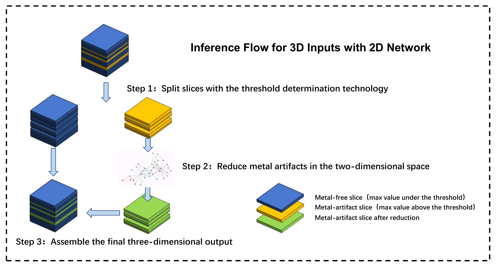
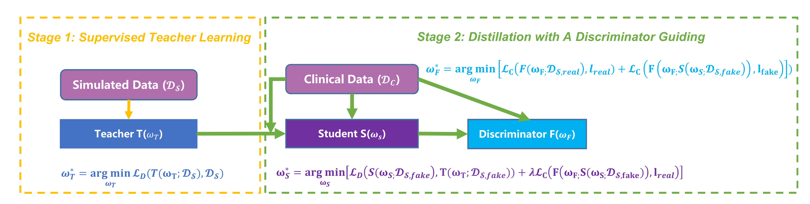
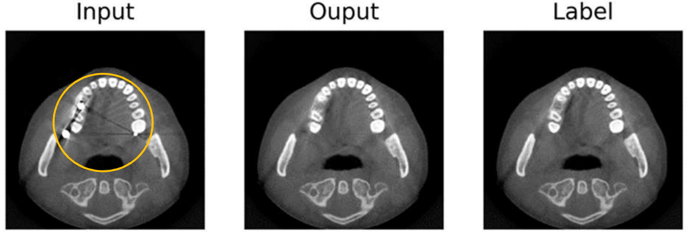

# Discriminator Guiding Knowledge Distillation Metal Artifact Reduction
**Codes for undergraduate thesis project: A Research on Deep Neural Network for 3D X-ray CT Artifact Reduction**

## Introduction
For deep learning based metal artifact reduction (MAR), problems such as lack of data and input-label mismatching make the supervised learning framework unapplicable.
Although some studies try solving these problems by training models on simulated data, the trained models cannot generalize to clinical data well, due to the different distribution of clinical data and simulated data. In addition, most of the existing researches are carried out on two-dimensional images, lack of exploration on three-dimensional images.

We design a metal artifact reduction algorithm for 3D X-ray CT based on deep learning. From the two perspectives of data inherent attributes and simulated-clinical data distribution differences, the problems of unsatisfactory data and poor model generalization in actual application are analyzed. At first, we apply data simulation and pre-training methods, and propose a **slice-based 3D metal artifact reduction** method. And then, to make the model trained on simulated data generalize to clinical data, a **discriminator guiding knowledge distillation (DGKD) method** is proposed.

## Slice-based 3D MAR

## Discriminator Guiding Knowledge Distillation

## Example Result
